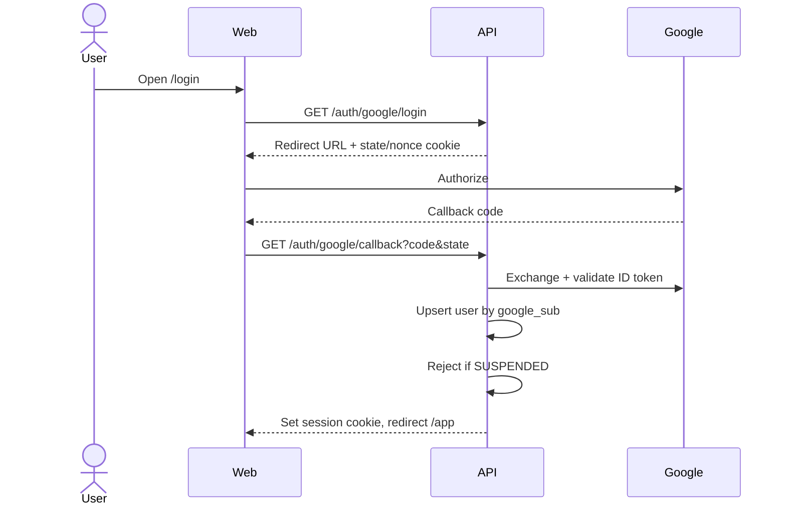
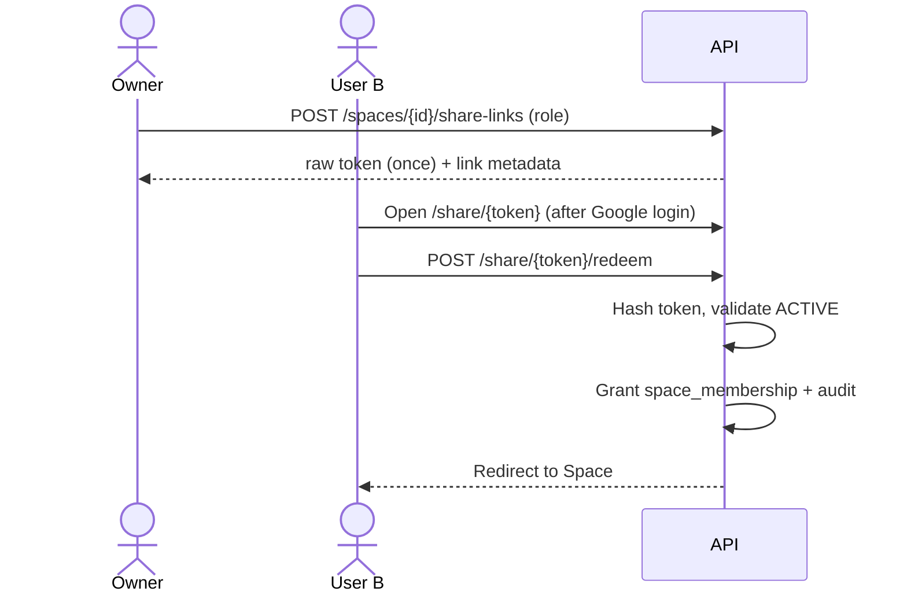
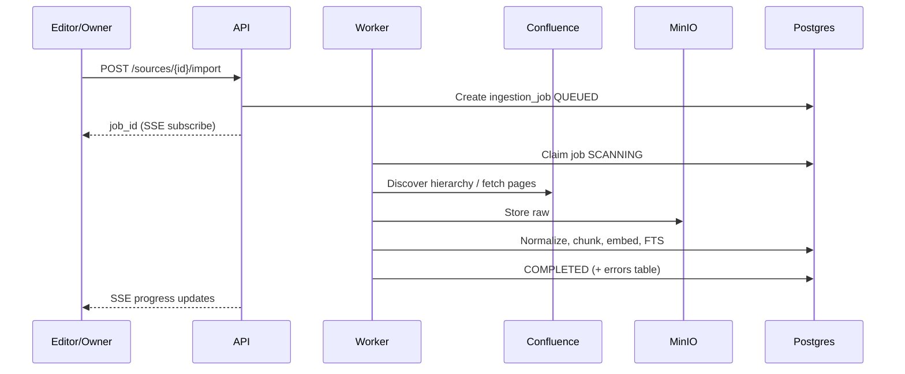
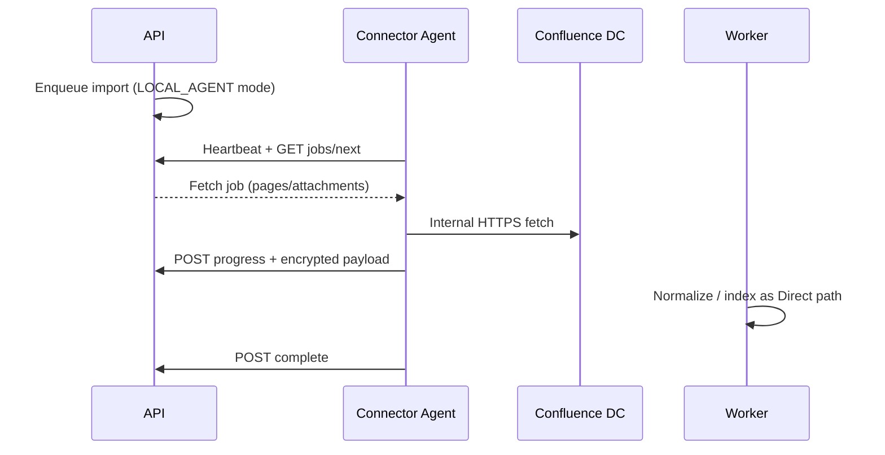
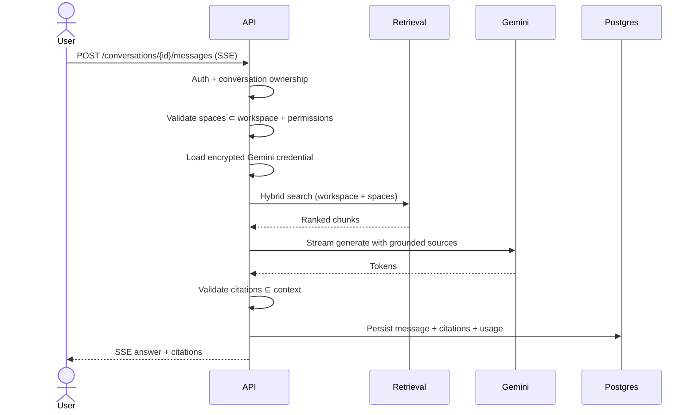

# Sequence Diagrams

## Login (Google OIDC)

```mermaid
sequenceDiagram
  actor U as User
  participant W as Web
  participant A as API
  participant G as Google

  U->>W: Open /login
  W->>A: GET /auth/google/login
  A-->>W: Redirect URL + state/nonce cookie
  W->>G: Authorize
  G-->>W: Callback code
  W->>A: GET /auth/google/callback?code&state
  A->>G: Exchange + validate ID token
  A->>A: Upsert user by google_sub
  A->>A: Reject if SUSPENDED
  A-->>W: Set session cookie, redirect /app
```

## Share Space

```mermaid
sequenceDiagram
  actor O as Owner
  actor B as User B
  participant A as API

  O->>A: POST /spaces/{id}/share-links (role)
  A-->>O: raw token (once) + link metadata
  B->>A: Open /share/{token} (after Google login)
  B->>A: POST /share/{token}/redeem
  A->>A: Hash token, validate ACTIVE
  A->>A: Grant space_membership + audit
  A-->>B: Redirect to Space
```

## Confluence Import — Direct

```mermaid
sequenceDiagram
  participant U as Editor/Owner
  participant A as API
  participant W as Worker
  participant C as Confluence
  participant S as MinIO
  participant DB as Postgres

  U->>A: POST /sources/{id}/import
  A->>DB: Create ingestion_job QUEUED
  A-->>U: job_id (SSE subscribe)
  W->>DB: Claim job SCANNING
  W->>C: Discover hierarchy / fetch pages
  W->>S: Store raw
  W->>DB: Normalize, chunk, embed, FTS
  W->>DB: COMPLETED (+ errors table)
  A-->>U: SSE progress updates
```

## Confluence Import — Local Agent

```mermaid
sequenceDiagram
  participant A as API
  participant Ag as Connector Agent
  participant C as Confluence DC
  participant W as Worker

  A->>A: Enqueue import (LOCAL_AGENT mode)
  Ag->>A: Heartbeat + GET jobs/next
  A-->>Ag: Fetch job (pages/attachments)
  Ag->>C: Internal HTTPS fetch
  Ag->>A: POST progress + encrypted payload
  W->>W: Normalize / index as Direct path
  Ag->>A: POST complete
```

## Ask AI

```mermaid
sequenceDiagram
  actor U as User
  participant A as API
  participant R as Retrieval
  participant G as Gemini
  participant DB as Postgres

  U->>A: POST /conversations/{id}/messages (SSE)
  A->>A: Auth + conversation ownership
  A->>A: Validate spaces ⊂ workspace + permissions
  A->>A: Load encrypted Gemini credential
  A->>R: Hybrid search (workspace + spaces)
  R-->>A: Ranked chunks
  A->>G: Stream generate with grounded sources
  G-->>A: Tokens
  A->>A: Validate citations ⊆ context
  A->>DB: Persist message + citations + usage
  A-->>U: SSE answer + citations
```
